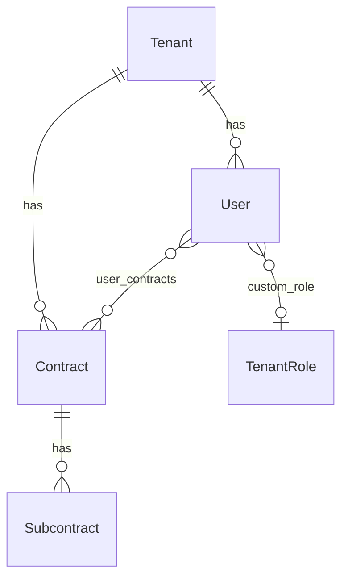
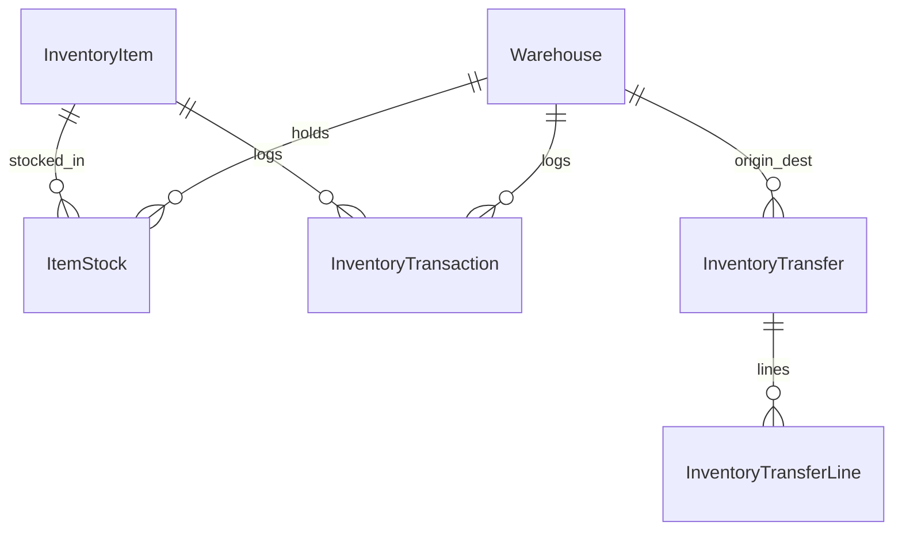
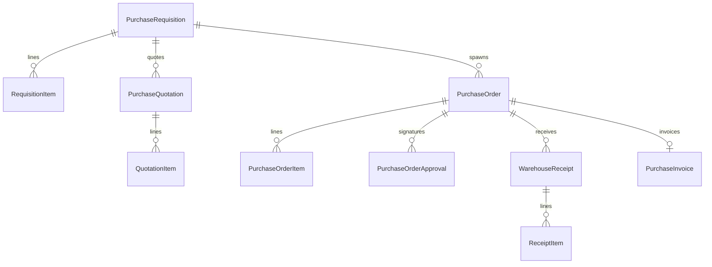
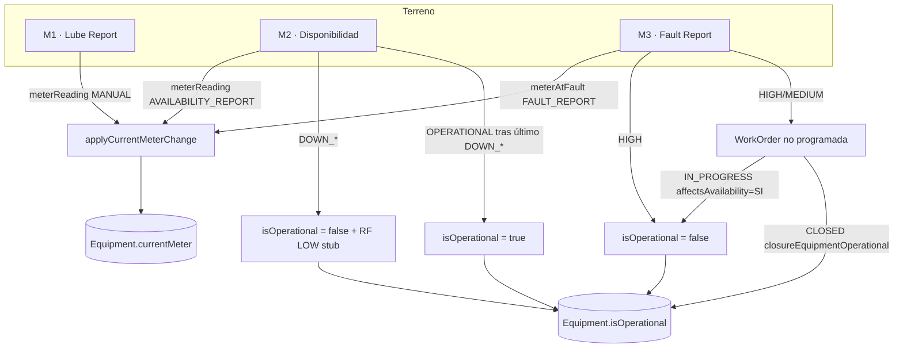

# Master Context — BaseLogic EAM (TPM / BL01)

| Metadato | Valor |
|----------|--------|
| **Última modificación** | 2026-06-08 |
| **Versión documento** | 1.1 |
| **Mantenido por** | Equipo TPM / agentes Cursor |

> Documento maestro de arquitectura funcional, lógica de negocio y estructura de datos.  
> **No sustituye** el código ni los ADRs; enlaza a las **fuentes canónicas** del repositorio.

---

## Cómo mantener este documento al día

Markdown **no se auto-actualiza**. Al cambiar cualquier fuente de la tabla inferior, **revisá y actualizá** este archivo (fecha en la cabecera + sección afectada). Los agentes deben hacerlo cuando modifiquen dominio, schema o APIs expuestas.

| Si cambiás… | Actualizá en MASTER-CONTEXT | Fuente canónica |
|-------------|------------------------------|-----------------|
| Modelo de datos / relaciones | §1 | [`backend/prisma/schema.prisma`](../backend/prisma/schema.prisma) |
| Módulos Nest, reglas de negocio | §2 | [`backend/src/features/`](../backend/src/features/) |
| Rutas UI, servicios HTTP | §3 | [`frontend/src/app/app.routes.ts`](../frontend/src/app/app.routes.ts), [`frontend/src/app/core/services/`](../frontend/src/app/core/services/) |
| Roles, PBAC, auth | §4 | [`docs/RBAC-PERMISSIONS-CATALOG.md`](RBAC-PERMISSIONS-CATALOG.md), [`backend/src/features/auth/`](../backend/src/features/auth/) |
| Flujo P2P compras | §2 (compras) | [`docs/PURCHASE-FLOWS.md`](PURCHASE-FLOWS.md), [`docs/PURCHASE-GOVERNANCE.md`](PURCHASE-GOVERNANCE.md) |
| Inventario / kardex / W2W | §2 (inventario) | [`docs/agentes/inventario-stock-transferencias-kardex.md`](agentes/inventario-stock-transferencias-kardex.md) |
| Notificaciones / correos | §2, §4 | [`docs/agentes/notificaciones-sistema.md`](agentes/notificaciones-sistema.md), [`docs/CORREOS-SISTEMA.md`](CORREOS-SISTEMA.md) |
| Decisiones de diseño recientes | Intro + §2 según tema | [`docs/agentes/decisiones.md`](agentes/decisiones.md) |
| Glosario de negocio | Términos en §1–4 | [`docs/agentes/glosario.md`](agentes/glosario.md) |
| Índice general agentes | — | [`AGENTS.md`](../AGENTS.md), [`docs/agentes/README.md`](agentes/README.md) |

**Índices que enlazan aquí:** [AGENTS.md](../AGENTS.md) · [docs/agentes/README.md](agentes/README.md)

---

## Resumen ejecutivo

| Área | Tecnología |
|------|------------|
| Backend | NestJS 11 — [`backend/`](../backend/) |
| Frontend | **Angular 18** (standalone, Signals) — [`frontend/`](../frontend/) |
| Datos | PostgreSQL 16 + Prisma — [`schema.prisma`](../backend/prisma/schema.prisma) |
| Prefijo API | `/api` — [`backend/src/main.ts`](../backend/src/main.ts) |

**TPM / BL01:** EAM industrial — flota, OTs, inventario multibodega, kardex inmutable, valorización **CPP**, multi-tenant, contratos/faenas.

---

## 1. Modelo de Datos y Entidades Principales (PostgreSQL)

Esquema único PostgreSQL gestionado por Prisma. Aislamiento primario: **`tenantId`** en casi todas las entidades de negocio. Segregación operativa: **`Contract`** (faena/contrato) y **`Subcontract`** (sub-faena).

### 1.1 Núcleo multi-tenant y sitios

| Entidad | Tabla | Relaciones clave |
|---------|-------|------------------|
| `Tenant` | `tenants` | 1→N `Contract`, `User`, `Equipment`, `WorkOrder`, inventario, compras |
| `Contract` | `contracts` | N→1 `Tenant`; 1→N `Subcontract`, `Equipment`, `Warehouse`, `PurchaseRequisition`, `PurchaseOrder` |
| `Subcontract` | `subcontracts` | N→1 `Contract`; 1→N `Equipment`, `WorkOrder`, `Warehouse` |
| `User` | `users` | N→1 `Tenant`; N→1 `TenantRole` (opcional); M→N `Contract` vía `UserContract` |
| `TenantRole` | `tenant_roles` | N→1 `Tenant`; `permissions Json[]`, `routes Json[]`, `baseRole` |

API de contratos: [`SitesController`](../backend/src/features/sites/sites.controller.ts) bajo ruta `/api/contracts`.

### 1.2 Flota / Equipos

| Entidad | Tabla | Cardinalidad |
|---------|-------|--------------|
| `Equipment` | `equipments` | N→1 `Tenant`; N→0..1 `Contract`; N→0..1 `Subcontract` |
| `MeterAdjustment` | `meter_adjustments` | N→1 `Equipment`, `User` |
| `EquipmentMeterLog` | `equipment_meter_logs` | N→1 `Tenant`, `Equipment`, `User` (fuente: `OT`, `MANUAL`, `TELEMETRY`) |
| `EquipmentAvailability` / `AvailabilityEvent` | `equipment_availabilities` / `availability_events` | Snapshot único por turno (M2) + ledger cronológico de eventos operacionales M2/M3 (`MANUAL`, `OT`, `FAULT_REPORT`, `LEGACY_SNAPSHOT`) |
| `AssetCostRecord` | `asset_cost_records` | N→1 `Equipment`; opcional `PurchaseOrder`, `WorkOrder`, `WarehouseReceipt` |

**Reglas de datos:** `@@unique([tenantId, internalId])`, placas y VIN únicos por tenant. `isOperational` y `cumulativeDowntimeHours` reflejan indisponibilidad por OT y por **fallas ALTAS** (M3). `currentMeter` es alimentado por OT, M1 (lubricantes), M2 (disponibilidad) y M3 (fallas) vía `applyCurrentMeterChange` — ver §2.4 «Ecosistema de Operaciones y Flota».

Código: [`equipments`](../backend/src/features/equipments/), [`meter-adjustments`](../backend/src/features/meter-adjustments/).

### 1.3 Catálogo único (EAM + inventario)

| Entidad | Tabla | Uso |
|---------|-------|-----|
| `CatalogItem` | `catalog_items` | Catálogo tenant: `EQUIPMENT_TYPE`, `BRAND`, `SYSTEM`, `FLUID`, `FUEL_TYPE`, `DRIVE_TYPE`, `OWNERSHIP` |
| `InventoryItem` | `inventory_items` | SKU `inventoryCode` (IN####), `partNumber`, categoría jerárquica, UoM, flags `isInventory` / `isAsset` / `isConsumable` |
| `ItemCategory` | `item_categories` | Árbol 2 niveles (`parentCategoryId`, `isGlobal` = familia) |
| `UnitOfMeasure` | `unit_of_measures` | Por tenant; `allowsDecimals` |
| `InventorySupplier` | `inventory_suppliers` | Proveedor habitual del artículo (≠ `Vendor` de compras) |
| `MaintenanceKit` | `maintenance_kits` | N→1 `Contract`; 1→N `MaintenanceKitPart` (pautas PM) |

**OT ↔ catálogo:** `WorkOrderSystem` (M→N `WorkOrder` ↔ `CatalogItem`), `WorkOrderFluid`, `FluidSample`.

Código: [`catalogs`](../backend/src/features/catalogs/), [`inventory-items`](../backend/src/features/inventory-items/), [`maintenance-kits`](../backend/src/features/maintenance-kits/).

### 1.4 Órdenes de trabajo (OT)

| Entidad | Tabla | Relación |
|---------|-------|----------|
| `WorkOrder` | `work_orders` | N→1 `Equipment`, `Tenant`; opc. `Subcontract`, `Warehouse`, usuarios creador/supervisor |
| `WorkOrderTask` | `work_order_tasks` | N→1 `WorkOrder` |
| `WorkOrderPart` | `work_order_parts` | N→1 `WorkOrder`; opc. `InventoryItem` |
| `WorkOrderFluidCompartment` | `work_order_fluid_compartments` | N→1 `WorkOrder`; compartimento + litros + `FluidAction` |
| `WorkOrderBacklogItem` | `work_order_backlog_items` | N→1 `WorkOrder`; `BacklogStatus` PENDING/DONE |
| `StockReservation` | `stock_reservations` | N→1 `WorkOrder`, `InventoryItem`, `Warehouse` (único por tripleta) |

**Estados:** `OtStatus`: `OPEN` → `IN_PROGRESS` → `ON_HOLD` → `CLOSED`.  
**Enums de negocio:** `OtCategory`, `MaintenanceType` (PREVENTIVO/CORRECTIVO), `AvailabilityImpact` (SI/NO/STP), tags en `classificationTags[]`.

Código: [`work-orders`](../backend/src/features/work-orders/), analytics: [`work-order-analytics`](../backend/src/features/work-order-analytics/).

### 1.5 Bodegas e inventario (stock + ledger)

| Entidad | Tabla | Relación |
|---------|-------|----------|
| `Warehouse` | `warehouses` | N→1 `Tenant`, `Contract`; opc. `Subcontract`; tipos `PHYSICAL` / `VIRTUAL` / `TRANSIT` |
| `WarehouseBin` | `warehouse_bins` | N→1 `Warehouse`; 1→N `ItemStock` |
| `ItemStock` | `item_stocks` | N→1 `Warehouse`, `InventoryItem`; **`@@unique([warehouseId, itemId])`**; `quantity`, `unitCost` (CPP) |
| `InventoryTransaction` | `inventory_transactions` | **Ledger inmutable** por movimiento; N→1 `Warehouse`, `InventoryItem`, `User` |
| `InventoryTransfer` | `inventory_transfers` | W2W; estados `SHIPPED` / `COMPLETED` / `CANCELLED` |
| `InventoryTransferLine` | `inventory_transfer_lines` | N→1 `InventoryTransfer`, `InventoryItem` |

**Tipos de movimiento (`TransactionType`):** `IN`, `OUT`, `ADJUST`, `RETURN`, `WORK_ORDER_RETURN`, `PURCHASE_RECEIPT`, `WORK_ORDER_ISSUE`, `TRANSFER_OUT`, `TRANSFER_IN`.

Guía operativa: [inventario-stock-transferencias-kardex.md](agentes/inventario-stock-transferencias-kardex.md).

Código: [`warehouses`](../backend/src/features/warehouses/), [`inventory-stock`](../backend/src/features/inventory-stock/), [`inventory-transfer`](../backend/src/features/inventory-transfer/), [`inventory-adjustment`](../backend/src/features/inventory-adjustment/), [`inventory-analytics`](../backend/src/features/inventory-analytics/).

### 1.6 Compras P2P (requerimientos → OC → recepción → factura)

| Entidad | Tabla | Flujo |
|---------|-------|-------|
| `PurchaseRequisition` | `purchase_requisitions` | SRC; estados `DRAFT`…`CLOSED` |
| `RequisitionItem` | `requisition_items` | Líneas; adjudicación vía `awardedQuotationItemId` |
| `PurchaseQuotation` | `purchase_quotations` | N cotizaciones por SRC |
| `QuotationItem` | `quotation_items` | Precio por línea de requerimiento |
| `PurchaseOrder` | `purchase_orders` | OC; split multiproveedor (`requisitionId`); firmas `requiredSignatures` |
| `PurchaseOrderItem` | `purchase_order_items` | Líneas; trazabilidad `sourceQuotationItemId` |
| `PurchaseOrderApproval` | `purchase_order_approvals` | Firma por nivel + `signatureHash` |
| `WarehouseReceipt` | `warehouse_receipts` | Guía recepción; `PENDING` / `PARTIAL` / `COMPLETED` |
| `ReceiptItem` | `receipt_items` | `quantityExpected`, `quantityReceived`, **`quantityConfirmed`** (delta a stock) |
| `PurchaseInvoice` | `purchase_invoices` | 1:1 con OC; 3-way match; `threeWayMatchOverruled*` |
| `PurchaseCreditNote` | `purchase_credit_notes` | Resta del acumulado facturado en match |
| `PurchaseSettings` | `purchase_settings` | Umbral, moneda, `invoiceMatchTolerancePercent` |
| `ApprovalPolicy` | `approval_policies` | Niveles con `minAmount`; M→N `User` vía `ApprovalPolicyUser` |
| `Vendor` | `vendors` | Maestro proveedores compras |
| `PurchaseDocument` | `purchase_documents` | Adjuntos unificados (REQ/OC/INVOICE) |
| `ActivityLog` | `activity_logs` | Auditoría transversal compras/inventario |

Flujos: [PURCHASE-FLOWS.md](PURCHASE-FLOWS.md) · Gobernanza firmas: [PURCHASE-GOVERNANCE.md](PURCHASE-GOVERNANCE.md).

Código: [`purchases`](../backend/src/features/purchases/), [`vendors`](../backend/src/features/vendors/).

### 1.7 Notificaciones y secuencias

| Entidad | Uso |
|---------|-----|
| `SequenceCounter` | Correlativos por `documentType` + `prefix` (OT, SRC, OC, guías) — [`sequence.service`](../backend/src/common/sequence/sequence.service.ts) |
| `TenantNotificationSetting` / `UserNotificationSetting` | Opt-in por `eventKey` + canal `EMAIL` / `WEB_PUSH` |
| `PushSubscription` | Web Push por usuario |
| `AuthAuditLog`, `UserSession`, `LoginStepUpChallenge` | Seguridad auth — [seguridad-auth.md](agentes/seguridad-auth.md) |

Eventos: [`notification-events.ts`](../backend/src/common/notifications/notification-events.ts).

---

## 2. Lógica de Negocio y Módulos Core (NestJS)

### 2.1 Mapa de controladores y servicios por dominio

Prefijo: `/api/{controller}`.

#### Operaciones (EAM / flota / OT)

| Controlador | Servicio | Responsabilidad |
|-------------|----------|-----------------|
| `equipments` | `EquipmentsService` | CRUD flota, filtros contrato, horómetro |
| `catalogs` | `CatalogsService` | Ítems de catálogo EAM por categoría |
| `work-orders` | `WorkOrdersService` | Ciclo de vida OT, backlog, cierre con consumo stock |
| `work-order-analytics` | `WorkOrderAnalyticsService` | KPIs y reportes OT |
| `maintenance-kits` | `MaintenanceKitsService` | Pautas PM por contrato |
| `meter-adjustments` | `MeterAdjustmentsService` | Ajustes de medidor con auditoría |
| `contracts` | `SitesService` | Contratos (faenas) |
| `subcontracts` | `SubcontractsService` | Subcontratos |

#### Inventario

| Controlador | Servicio | Responsabilidad |
|-------------|----------|-----------------|
| `inventory-items` | `InventoryItemsService` | Catálogo maestro, adjuntos, alta + notificación |
| `item-categories` | `ItemCategoriesService` | Familias / subcategorías |
| `inventory-suppliers` | `InventorySuppliersService` | Proveedores de catálogo |
| `units-of-measure` | `UnitsOfMeasureService` | UoM |
| `warehouses` | `WarehousesService` | Bodegas por contrato/subcontrato |
| `warehouses/:id/bins` | `WarehouseBinsService` | Ubicaciones internas |
| `inventory-stock` | `InventoryStockService` | Stock, kardex, despacho OT, devoluciones, CPP en movimientos |
| `inventory-adjustments` | `InventoryAdjustmentService` | Ajustes con transacción `ADJUST` |
| `inventory-transfers` | `InventoryTransferService` | W2W atómico (`TRANSFER_OUT` + `TRANSFER_IN`) |
| `inventory-analytics` | `InventoryAnalyticsService` | Valorización Σ(qty × CPP) |

#### Compras

| Controlador | Servicio |
|-------------|----------|
| `purchase-requisitions` | `PurchaseRequisitionsService` |
| `purchase-orders` | `PurchaseOrdersService` |
| `warehouse-receipts` | `WarehouseReceiptsService` |
| `purchase-invoices` | `PurchaseInvoicesService` |
| `purchase-credit-notes` | `PurchaseCreditNotesService` |
| `purchase-settings` | `PurchaseSettingsService` |
| `purchase-documents` | `PurchaseDocumentsService` |
| `purchases/analytics` | `PurchasesAnalyticsService` |
| `vendors` | `VendorsService` |

Módulo raíz: [`purchases.module.ts`](../backend/src/features/purchases/purchases.module.ts).

#### Notificaciones y plataforma

| Controlador | Servicio / componente |
|-------------|----------------------|
| `notifications` | `NotificationsService` (Web Push) |
| `notification-settings` | `NotificationSettingsService` |
| — | [`NotificationDispatcherService`](../backend/src/common/notifications/notification-dispatcher.service.ts) |
| `auth` | `AuthService`, `TotpService`, `LoginStepUpService` |
| `users` | `UsersService` |
| `tenant-roles` | `TenantRolesService` |
| `tenant-config` | `TenantConfigService` |
| `admin/security` | `SecurityAdminService` |
| `super-admin/platform` | `PlatformDataAdminService` |

Registro módulos app: [`app.module.ts`](../backend/src/app.module.ts).

### 2.2 Flujos críticos — reglas explícitas en código

#### A) OT: ejecución, cierre y backlog

**Implementación:** [`work-orders.service.ts`](../backend/src/features/work-orders/work-orders.service.ts) · API: [`work-orders.controller.ts`](../backend/src/features/work-orders/work-orders.controller.ts).

**Creación (`create`):** valida equipo en tenant; genera correlativo; puede marcar equipo no operativo si `affectsAvailability === 'SI'` al pasar a `IN_PROGRESS`.

**Transiciones (`updateStatus`):**
- `IN_PROGRESS` + impacto disponibilidad → `equipment.isOperational = false`.
- **`CLOSED`** — transacción atómica con validaciones:
  - Detención: `detentionStartedAt` / `detentionEndedAt` obligatorios; `metricHm` = horas de detención.
  - Atención mecánica obligatoria; `metricHh` = `metricHm × personnelQuantity`.
  - `finalMeter` ≥ `initialMeter` salvo `MeterAdjustment` reciente que justifique reinicio.
  - `closureEquipmentOperational` booleano obligatorio.
  - Repuestos/fluidos de inventario → `warehouseId` obligatorio.
  - Por parte/fluido con `inventoryItem.isInventory`: descuenta vía **`InventoryStockService.performTransactionCore`** (`WORK_ORDER_ISSUE`), congela `unitCost`. Stock negativo → `isPendingRegularization = true` **salvo** `TenantOperationalConfig.blockNegativeStock = true` → `BadRequestException`.
  - Fluidos: validación UoM (`allowsDecimals`), umbral de consumo inusual (`confirmedLargeFluidDispatch` en cierre).
  - Horómetro vía `applyCurrentMeterChange` (`EquipmentMeterLog` fuente OT).
  - Opcional `AssetCostRecord` tipo `WORK_ORDER`.

**Backlog (`WorkOrderBacklogItem`):**
- `POST /work-orders/:id/backlog` → ítem `PENDING`, `hasBacklog = true`.
- `GET /work-orders/backlog` — listado global por contratos del usuario.
- `PATCH .../backlog/:itemId` — `DONE`.
- `POST .../backlog/:itemId/promote` — `TO_TASK` → `WorkOrderTask`; `TO_NEW_OT` → nueva OT.

**Filtro de acceso:** `workOrderAccessWhere` + `equipmentAccessWhere` — ADMIN/SUPER_ADMIN + header `x-site-id` / `x-contract-id` (`ALL` sin filtro); resto por `allowedContracts`.

#### B) Ledger inmutable y W2W

**Principio:** cada cambio de cantidad → fila en `inventory_transactions` con `previousStock`, `newStock`, `type`, `referenceId` + `referenceType`.

**Recepción (`WarehouseReceiptsService.confirm`):**
- Solo mueve **delta** = `quantityReceived − quantityConfirmed` (parciales sin doble conteo).
- No sobre-recibir vs OC agregada.
- Recalcula **CPP** al `PURCHASE_RECEIPT`.
- Guía `PARTIAL` / `COMPLETED`; actualiza estado OC.
- Ver decisión 2026-05-19: [decisiones.md](agentes/decisiones.md).

**W2W (`InventoryTransferService`):**
- PBAC: `inventory:transfer:read` / `create` / `approve`; alcance contrato en `USER`.
- `create`: `TRANSFER_OUT`, estado `SHIPPED`.
- `confirmReception`: `TRANSFER_IN`; CPP destino = promedio ponderado.

**Cierre OT / devoluciones:** consumos no recalculan CPP; `WORK_ORDER_RETURN` incrementa qty sin alterar CPP.

#### C) Compras: aprobación OC y 3-Way Match

**Aprobación (`PurchaseOrdersService.approve`):**
- OC en `PENDING_APPROVAL` o `PARTIALLY_APPROVED`.
- Usuario en `ApprovalPolicyUser`; `minAmount` ≤ monto OC.
- Firmas secuenciales por `level`; hash en `signatureHash`.
- Al completar `requiredSignatures` → `APPROVED`.

**3-Way Match (`PurchaseInvoicesService.computeThreeWayMatchNumbers`):**
- Tolerancia: `PurchaseSettings.invoiceMatchTolerancePercent` (default 1%).
- `matchPo`: \|factura neta − OC\| ≤ margen % del OC.
- `matchReceived`: factura neta ≤ recepcionado + margen %.
- Factura neta = Σ facturas OC − Σ notas de crédito.
- Estados: `PENDING` → `MATCHED` | `DISCREPANCY`; pago solo si `MATCHED`.
- **Overrule:** permiso `purchases:invoice:overrule` + `canOverruleThreeWayMatch` (o `SUPER_ADMIN`).

### 2.3 DTOs y payloads relevantes

| DTO / tipo | Módulo | Archivo |
|------------|--------|---------|
| `CreateEquipmentDto` / `UpdateEquipmentDto` | equipments | [`dto/`](../backend/src/features/equipments/dto/) |
| `CreateCatalogDto` / `UpdateCatalogDto` | catalogs | [`dto/`](../backend/src/features/catalogs/dto/) |
| `CreateWorkOrderDto` / `UpdateWorkOrderDto` | work-orders | definidos en [`work-orders.service.ts`](../backend/src/features/work-orders/work-orders.service.ts) |
| `CreateInventoryItemDto` / `UpdateInventoryItemDto` / `QuickCreateItemDto` | inventory-items | [`dto/`](../backend/src/features/inventory-items/dto/) |
| `CreateInventoryStockDto` / `UpdateInventoryStockDto` | inventory-stock | [`dto/`](../backend/src/features/inventory-stock/dto/) |
| `CreateInventoryTransferDto` + `TransferLineDto` | inventory-transfer | [`inventory-transfer.service.ts`](../backend/src/features/inventory-transfer/inventory-transfer.service.ts) |
| `CreateWarehouseDto` / `UpdateWarehouseDto` | warehouses | [`dto/`](../backend/src/features/warehouses/dto/) |
| `LineAwardsDto` | purchases | [`line-awards.dto.ts`](../backend/src/features/purchases/dto/line-awards.dto.ts) |
| Payloads SRC (mirror frontend) | purchases | [`purchases.interface.ts`](../frontend/src/app/core/models/purchases.interface.ts) |
| `CreateTenantRoleDto` / `UpdateTenantRoleDto` | tenant-roles | [`dto/`](../backend/src/features/tenant-roles/dto/) |
| Notificaciones | notification-settings | [`dto/`](../backend/src/features/notification-settings/dto/) |

### 2.4 Ecosistema de Operaciones y Flota (M1 · M2 · M3 ↔ `Equipment`)

Los tres módulos de Operaciones en terreno —**M1 Consumo de Lubricantes**, **M2 Disponibilidad Operativa Diaria** y **M3 Registro e Informe de Fallas**— **no son silos**: convergen sobre la entidad [`Equipment`](../backend/prisma/schema.prisma) y comparten dos señales transversales que el resto del sistema (Maestro de Flota, modales de detalle, OTs, costeo) consume como **fuente única de verdad (SSOT)**:

1. **`currentMeter`** — horómetro/odómetro vigente del equipo.
2. **`isOperational`** — bandera booleana de estado operativo (en servicio / fuera de servicio).

Código backend: [`lube-reports`](../backend/src/features/lube-reports/), [`equipment-availability`](../backend/src/features/equipment-availability/), [`fault-reports`](../backend/src/features/fault-reports/), [`equipments`](../backend/src/features/equipments/), [`work-orders`](../backend/src/features/work-orders/).

#### A) Alimentación de `currentMeter` (helper único)

Todo avance de medidor pasa por el helper atómico **[`applyCurrentMeterChange`](../backend/src/features/equipments/equipment-meter-sync.ts)**, que escribe en `EquipmentMeterLog` (auditoría inmutable) y actualiza `Equipment.currentMeter` dentro de la misma transacción. **Regla universal: el medidor nunca retrocede.** Cada módulo aporta una `MeterLogSource` distinta:

| Módulo | Disparador | Condición | `MeterLogSource` | Si retrocede |
|--------|-----------|-----------|------------------|--------------|
| **M1 Lubricantes** | `LubeReportsService.create` (`meterReading`) | `> currentMeter` | `MANUAL` | **Rechaza** (`BadRequestException`) |
| **M2 Disponibilidad** | `EquipmentAvailabilityService.create` (`meterReading`) | `> currentMeter` | `AVAILABILITY_REPORT` | Silent ignore (lectura tardía) |
| **M3 Fallas** | `FaultReportsService.create` (`meterAtFault`) | `> currentMeter` | `FAULT_REPORT` | Silent ignore |
| OT (cierre) | `WorkOrdersService` (`finalMeter`) | `≥ initialMeter` | `OT` | Validación de cierre |

Consecuencia transversal: cualquier reporte en terreno (un despacho de aceite, un parte de disponibilidad o una falla) **mantiene vivo el horómetro** que usan las proyecciones PM y el Maestro de Flota, sin requerir un registro manual de horas aparte.

#### B) Control de `isOperational` (quién lo mueve)

`isOperational` es la señal imperativa que consumen Maestro de Flota, tablero y modal de equipo. Para garantizar la consistencia e integridad transaccional del estado de los equipos, el **`EquipmentOperationalOrchestratorService` es el único punto de mutación autorizada** de este atributo en la base de datos (encargado de actualizar `isOperational`, registrar `AvailabilityEvent` en el Ledger, gatillar stubs de fallas M3, y emitir alertas a través del dispatcher).

Los flujos coordinados por el orquestador son:

| Origen | Evento | Efecto sobre `isOperational` |
|--------|--------|------------------------------|
| **M3 Falla ALTA (`HIGH`)** | `FaultReportsService.create` | `false` + crea `WorkOrder(NO_PROGRAMADA_REACTIVA, affectsAvailability=SI, detentionStartedAt=eventDate)` en la misma `$transaction` Serializable |
| **M3 Falla MEDIA (`MEDIUM`)** | `FaultReportsService.create` | **Sin cambio** — crea `WorkOrder(NO_PROGRAMADA_CORRECTIVA, affectsAvailability=NO)` |
| **M3 Falla BAJA (`LOW`)** | `FaultReportsService.create` | **Sin cambio** — solo registra el reporte (`OPEN`) |
| **M2 Disponibilidad `DOWN_FAILURE` / `DOWN_MAINTENANCE`** | `EquipmentOperationalOrchestratorService` dentro de `EquipmentAvailabilityService` | `false`; si no existe RF activo (`OPEN` o `LINKED` con OT no cerrada), crea stub `FaultReport` `OPEN/LOW` (`FAULT_REP`) para completar diagnóstico |
| **M2 Disponibilidad `OPERATIONAL`** | Nuevo parte o edición tras último M2 `DOWN_*` | `true`; el estado anterior se resuelve desde el mismo turno editado, el turno DAY del mismo día para NIGHT, o el último parte previo del equipo |
| **OT** | `updateStatus → IN_PROGRESS` con `affectsAvailability=SI` | `false` |
| **OT** | `updateStatus → CLOSED` | `isOperational = closureEquipmentOperational` (booleano obligatorio); si `affectsAvailability=SI` acumula `cumulativeDowntimeHours += metricHm` |

**Relación M3 ↔ M2:** M3 sigue siendo el flujo rico de diagnóstico/OT por criticidad. M2 puede declarar indisponibilidad operacional de turno y crear un RF stub LOW para no perder trazabilidad; el supervisor o mantenedor completa el detalle en M3. `GET /unreported` sigue filtrando `isOperational: true` para no exigir parte a equipos detenidos, salvo que vuelvan a quedar operativos por M2 `OPERATIONAL` u OT cerrada.

**Modelo híbrido M2/M3 (2026-06-09):** `EquipmentAvailability` permanece como snapshot declarativo de M2 por turno y mantiene el cálculo actual de PA%. El ledger `AvailabilityEvent` se ha desacoplado de M2 (su FK es opcional) para permitir que flujos ajenos a los turnos (ej. Fallas M3 vía `faultReportId`) inserten eventos cronológicos de forma directa. La migración `20260608_add_availability_events` inicializó el ledger y la `20260609...` lo desacopló de los snapshots.

#### C) Costeo e inventario (M1 y fluidos OT)

M1 cruza con Inventario y Finanzas en transacción Serializable: descuenta `ItemStock` desde bodega `VIRTUAL` (camión lubricador) vía **`performTransactionCore`** (`OUT`, `referenceType=LUBE_DISPATCH`), CPP congelado e imputa `AssetCostRecord(LUBE_DISPATCH)`. El cierre de OT usa el mismo núcleo para repuestos y fluidos (`WORK_ORDER_ISSUE`).

**Stock negativo (regla transversal):**

| `blockNegativeStock` | Comportamiento |
|---------------------|----------------|
| `false` (default) | Permite saldo negativo; marca `isPendingRegularization` en kardex |
| `true` | Rechaza con `BadRequestException` — mensaje unificado vía `stock-quantity.util` |

Flag en [`TenantOperationalConfig`](../backend/prisma/schema.prisma) (`block_negative_stock`); configurable en **Ajustes → Empresa**. Aritmética de cantidades: `Decimal.js` + epsilon `1e-9` en runtime (columna DB sigue `Float`).

**UI:** componente shared [`app-fluid-quantity-row`](../frontend/src/app/shared/components/fluid-quantity-row/) en M1 y OT; stock disponible en picker (`stockAvailableQuantity` = físico − reservas). Ver decisión [2026-06-04 — Integridad de fluidos](agentes/decisiones.md).

#### D) Implicancia para la UI (SSOT en frontend)

El Maestro de Flota y el modal de detalle de equipo reaccionan centralizadamente a `isOperational`, `currentMeter` e historial operacional con `FleetStateService.equipmentUpdated$` (Subject local + BroadcastChannel/localStorage para otras pestañas). `FleetService.notifyEquipmentChanged(equipmentId)` se conserva como alias de compatibilidad y bump de `listVersion` / `equipmentRevision`. M2 emite desde `EquipmentAvailabilityService` tras create/batch/import exitosos; M3 emite desde `FaultReportsService` tras create/escalamiento; M1/OT siguen usando `FleetService.notifyEquipmentChanged`. Además, `GET /equipments` enriquece cada fila con `actionRequiredFault` cuando existe RF `OPEN`/`LINKED` y el último M2 no está en `DOWN_MAINTENANCE`, para visibilidad inmediata en el Maestro. Ver decisiones [2026-06-03 — Integración Transversal de Operaciones](agentes/decisiones.md) y [2026-06-07 — P4 refresh Flota](agentes/decisiones.md).

---

## 3. Frontend y Flujos de Usuario (Angular 18)

> Cliente: **Angular 18** (`standalone: true`, Signals, `@if`/`@for`). No React.

### 3.1 Enrutamiento principal

Fuente: [`frontend/src/app/app.routes.ts`](../frontend/src/app/app.routes.ts).

| Ruta | Dominio |
|------|---------|
| `/auth/*` | Login, activación, recuperación clave |
| `/app/dashboard` | Dashboard |
| `/app/flota`, `/app/flota/registro-horas` | Flota, horómetros |
| `/app/ots`, `/ots/nueva`, `/ots/backlog`, `/ots/analytics`, `/ots/:id` | OTs |
| `/app/kits/*` | Pautas PM |
| `/app/articulos/*` | Catálogo inventario |
| `/app/inventario/*` | Bodegas, transferencias, stock, valorización, abastecimiento |
| `/app/compras/*` | Proveedores, SRC, OC, recepciones, facturas, analytics, config |
| `/app/catalogos` | Catálogos EAM |
| `/app/configuracion/*` | Empresa, contratos, notificaciones, gobernanza roles |
| `/app/usuarios`, `/app/roles` | IAM tenant |
| `/app/admin/*` | Super admin |

Navegación: [`nav.config.ts`](../frontend/src/app/core/navigation/nav.config.ts) + PBAC [`purchases-permissions.ts`](../frontend/src/app/core/constants/purchases-permissions.ts) y [`inventory-permissions.ts`](../frontend/src/app/core/constants/inventory-permissions.ts) (`I.*` en menú, guards y `*appHasPermission`).

### 3.2 Servicios HTTP → API crítica

Base: `environment.apiUrl` + interceptores JWT y contrato activo.

| Servicio | Archivo | API principal |
|----------|---------|---------------|
| `AuthService` | [`auth.service.ts`](../frontend/src/app/core/services/auth/auth.service.ts) | `/api/auth/*`, `permissions[]` JWT |
| `FleetService` | [`fleet.service.ts`](../frontend/src/app/core/services/fleet/fleet.service.ts) | `/api/equipments` |
| `WorkOrdersService` | [`work-orders.service.ts`](../frontend/src/app/core/services/work-orders/work-orders.service.ts) | `/api/work-orders` |
| `InventoryItemsService` | [`inventory-items.service.ts`](../frontend/src/app/core/services/inventory-items/inventory-items.service.ts) | `/api/inventory-items` |
| `InventoryStockService` | [`inventory-stock.service.ts`](../frontend/src/app/core/services/inventory-stock/inventory-stock.service.ts) | `/api/inventory-stock` |
| `InventoryTransferService` | [`inventory-transfer.service.ts`](../frontend/src/app/core/services/inventory-transfer/inventory-transfer.service.ts) | `/api/inventory-transfers` |
| `WarehousesService` | [`warehouses.service.ts`](../frontend/src/app/core/services/warehouses/warehouses.service.ts) | `/api/warehouses` |
| `PurchasesService` | [`purchases.service.ts`](../frontend/src/app/core/services/purchases/purchases.service.ts) | P2P completo |
| `VendorsService` | [`vendors.service.ts`](../frontend/src/app/core/services/vendors/vendors.service.ts) | `/api/vendors` |
| `ContractsService` | [`contracts.service.ts`](../frontend/src/app/core/services/contracts/contracts.service.ts) | `/api/contracts` |
| `TenantRolesService` | [`tenant-roles.service.ts`](../frontend/src/app/core/services/tenant-roles/tenant-roles.service.ts) | `/api/tenant-roles` |

**Directiva PBAC:** `*appHasPermission` · bypass `ADMIN` / `SUPER_ADMIN` en `AuthService.hasPermission()`.

---

## 4. Seguridad, Roles y Configuración

### 4.1 Autenticación

| Mecanismo | Implementación |
|-----------|----------------|
| Login | [`auth.service.ts`](../backend/src/features/auth/auth.service.ts) — anti-enumeración |
| JWT | Bearer; `sub`, `role`, `permissions[]`, `jti`, `operationalConfig` (`hasNightShift`, horarios, `blockNegativeStock`) — ver `jwt-operational-config.util.ts` |
| Sesiones | [`user-session.service.ts`](../backend/src/features/auth/user-session.service.ts) |
| 2FA | TOTP + email 2FA + step-up — [seguridad-auth.md](agentes/seguridad-auth.md) |
| SUPER_ADMIN tenant | Header `x-tenant-id` en [`jwt.strategy.ts`](../backend/src/features/auth/strategies/jwt.strategy.ts); sin `operationalConfig` en JWT — hidratar vía `GET /tenant-config` al elegir tenant |
| Turnos M2 (frontend) | [`ShiftService`](../frontend/src/app/core/services/shift/shift.service.ts): `hasNightShift`, `coerceShift()`, `currentShift()`; API coerciona `NIGHT`→`DAY` si no hay turno noche |
| Auditoría | `AuthAuditLog` |

### 4.2 Multi-tenant y aislamiento por empresa/contrato

| Capa | Regla |
|------|-------|
| Datos | `tenantId` en consultas Prisma |
| Contratos | `UserContract` → `allowedContracts[]` en JWT |
| Contexto UI | `x-contract-id` / `x-site-id`; `ALL` solo ADMIN/SUPER_ADMIN |
| `USER` (y perfiles custom) | Filtro por `allowedContracts` en JWT |
| Compras | `assertUserHasContractAccess` en servicios P2P |

Reglas agente: [`.cursor/rules/tpm-arquitectura.mdc`](../.cursor/rules/tpm-arquitectura.mdc).

### 4.3 Matriz de roles y permisos

#### Roles enum (`UserRole`)

| Rol | Alcance |
|-----|---------|
| `SUPER_ADMIN` | Multi-tenant; bypass PBAC |
| `ADMIN` | Tenant completo; bypass `PermissionsGuard` |
| `USER` | Sin privilegios por defecto; capacidades vía `TenantRole.permissions` + contratos `UserContract` |

#### PBAC Compras

- **41 llaves** `purchases:*` en [`permissions.enum.ts`](../backend/src/features/auth/constants/permissions.enum.ts).
- Catálogo humano: [RBAC-PERMISSIONS-CATALOG.md](RBAC-PERMISSIONS-CATALOG.md).
- Frontend espejo: [`purchases-permissions.ts`](../frontend/src/app/core/constants/purchases-permissions.ts).
- Guard: [`permissions.guard.ts`](../backend/src/features/auth/guards/permissions.guard.ts) — AND; bypass ADMIN/SUPER_ADMIN.

#### PBAC Inventario (2026-05-19)

- **15 llaves** `inventory:*` (artículo, bodega, categoría, transferencia W2W, stock/ajuste) — controladores en `inventory-items`, `warehouses`, `item-categories`, `inventory-transfer`, `inventory-stock`, `inventory-adjustment`.
- Frontend: [`inventory-permissions.ts`](../frontend/src/app/core/constants/inventory-permissions.ts), `permissionGuard` en rutas `/app/articulos/*` y `/app/inventario/*`, formularios en solo lectura sin permiso de mutación, `GlobalItemPicker` quick-add solo con `inventory:item:create`.
- Pendiente PBAC: `inventory-suppliers`, `inventory-analytics` (siguen `@Roles`).

#### PBAC Operaciones (2026-05-19)

- **16 llaves** `operations:*` (equipo, OT, horómetro, pautas PM, backlog) en [`permissions.enum.ts`](../backend/src/features/auth/constants/permissions.enum.ts).
- Backend migrado: `equipments`, `work-orders`, `maintenance-kits`, `meter-adjustments`, `work-order-analytics` — `PermissionsGuard` + `@RequirePermissions` / `@RequireAnyPermissions`; ABAC en servicios sin cambios.
- Frontend: pendiente (siguiente sprint).

#### Flags ABAC adicionales

| Flag | Uso |
|------|-----|
| `User.canOverruleThreeWayMatch` | Excepción 3-way |
| Estado documento | Servicios rechazan transiciones inválidas |
| Owner SRC | `update-own` solo solicitante en `DRAFT` |

#### Notificaciones despachadas (dispatcher activo)

- `PURCHASE_REQUISITION_DRAFT_CREATED`, `PURCHASE_REQUISITION_SUBMITTED`
- `INVENTORY_ITEM_CREATED`

Inventario completo: [notificaciones-sistema.md](agentes/notificaciones-sistema.md) · Correos: [CORREOS-SISTEMA.md](CORREOS-SISTEMA.md).

### 4.4 Configuración tenant relevante

| Campo / entidad | Efecto |
|-----------------|--------|
| `Tenant.primaryColor`, logos, `laborRatePerHour` | Branding + HH en OT |
| `Tenant.sidebarPermissions` | Override menú |
| `PurchaseSettings` + `ApprovalPolicy` | Firmas OC |
| `invoiceMatchTolerancePercent` | 3-way match |
| Notification settings | Opt-in por evento |

---

## Referencias rápidas

| Documento | Contenido |
|-----------|-----------|
| [AGENTS.md](../AGENTS.md) | Índice agentes |
| [README.md](../README.md) | Visión e instalación |
| [RBAC-PERMISSIONS-CATALOG.md](RBAC-PERMISSIONS-CATALOG.md) | PBAC compras + inventario |
| [PURCHASE-FLOWS.md](PURCHASE-FLOWS.md) | Flujo P2P |
| [PURCHASE-GOVERNANCE.md](PURCHASE-GOVERNANCE.md) | Firmas ACL |
| [decisiones.md](agentes/decisiones.md) | Decisiones recientes |
| [glosario.md](agentes/glosario.md) | Términos TPM |

---

*Fin del Master Context. Al editar fuentes canónicas, actualizá la fecha en la cabecera y la tabla «Cómo mantener este documento al día».*
