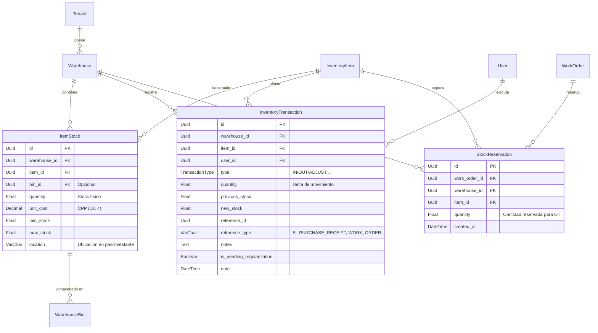
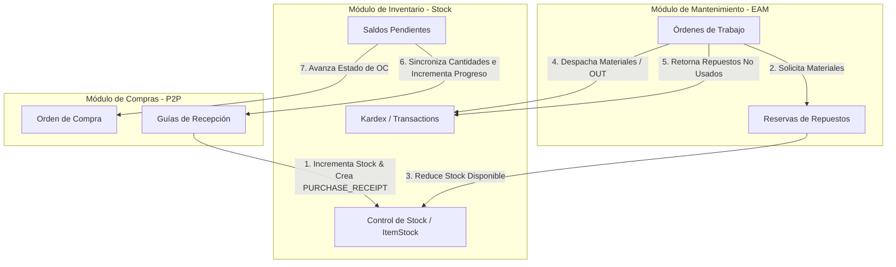

# Auditoría Técnica y Funcional: Módulo de Control de Stock (EAM / Inventory)

Este documento constituye la **Fuente Única de Verdad (Single Source of Truth)** sobre el diseño arquitectónico, el flujo de datos transaccional, las reglas de negocio y los mecanismos de seguridad del módulo de **Control de Stock** de **BaseLogic EAM**.

> [!NOTE]
> Esta auditoría se ha realizado mediante **inspección estática de código**. No se ha modificado, refactorizado ni alterado ningún archivo del repositorio.

---

## 1. Alcance y Contexto General

* **Ruta Frontend:** `/app/inventario/stock` (controlado por `StockDashboardComponent`).
* **Controladores Backend:** 
  * `InventoryStockController` (Ruta base: `/api/inventory-stock`)
  * `InventoryAdjustmentController` (Ruta base: `/api/inventory-adjustments`)
* **Servicios Backend:**
  * `InventoryStockService` (Gestión de stock físico, reservas, transacciones, ledger e IRA)
  * `InventoryAdjustmentService` (Ajustes de inventario y reconciliación con compras)
* **Aislamiento Multi-Tenant:** Cada consulta de base de datos (Prisma) filtra estrictamente por el `tenantId` del usuario autenticado (extraído a través de `JwtAuthGuard` y inyectado en `req.user`). Adicionalmente, se valida la correspondencia de bodegas y transacciones con los contratos asignados al usuario en su perfil operativo.

---

## 2. Estructura de Datos en Base de Datos (Prisma)

El módulo interactúa principalmente con los siguientes modelos en `schema.prisma`:

### Tabla de Modelos de Datos Relevantes

| Tabla en BD | Entidad Prisma | Propósito / Reglas de Integridad |
| :--- | :--- | :--- |
| `item_stocks` | `ItemStock` | **Estado actual del stock.** Clave única compuesta `@@unique([warehouseId, itemId])`. Define el saldo físico actual, CPP de la bodega, umbrales de alerta (`minStock`, `maxStock`) y ubicación física independiente. |
| `inventory_transactions` | `InventoryTransaction` | **Kardex Histórico Inmutable.** Registra cada incremento, decremento o ajuste. Las filas son estrictamente de inserción y no se editan ni eliminan, garantizando trazabilidad de auditoría. |
| `stock_reservations` | `StockReservation` | **Reservas de Stock.** Registra cantidades comprometidas por Órdenes de Trabajo (OT) abiertas. Afecta el cálculo del stock disponible (`availableQuantity = physicalQuantity - reservedQuantity`). |
| `warehouses` | `Warehouse` | **Bodega.** Scoped por tenant y asignada a un contrato (`contractId`) y subcontrato (`subcontractId`). Los movimientos manuales de inventario validan el acceso del usuario al contrato correspondiente. |
| `inventory_items` | `InventoryItem` | **Catálogo de Artículos.** Maestro centralizado por tenant. Contiene códigos internos (`inventoryCode`), números de parte (`partNumber`), y parámetros de serialización/consumo. |

---

## 3. Catálogo de Endpoints de la API Backend

Todos los endpoints exigen autenticación a través de `JwtAuthGuard` y control de acceso basado en permisos mediante `PermissionsGuard` y `@RequirePermissions`.

### 3.1 Endpoints de `InventoryStockController` (`/api/inventory-stock`)

| Método | Ruta | Permiso Requerido | Descripción de Lógica Interna |
| :---: | :--- | :--- | :--- |
| `GET` | `/supply-alerts` | `INVENTORY_STOCK_READ` | Obtiene artículos con stock inferior o igual al mínimo establecido (`minStock`), cruzando `ItemStock` de todas las bodegas visibles del tenant. |
| `GET` | `/inventory-record-accuracy` | `INVENTORY_STOCK_READ` | Calcula el indicador **IRA** en los últimos 30 días, filtrable por bodega. Mide la exactitud del inventario a partir de ajustes por error de conteo vs stock en sistema. |
| `GET` | `/warehouse/:warehouseId/pending-regularization` | `INVENTORY_STOCK_READ` | Obtiene listado paginado de saldos negativos o transacciones marcadas como `isPendingRegularization = true` en una bodega. |
| `GET` | `/warehouse/:warehouseId/item/:itemId/stock-position` | `INVENTORY_STOCK_READ` | Retorna la ubicación y cantidad disponible para un artículo específico en una bodega para flujos manuales de inventario. |
| `GET` | `/warehouse/:warehouseId/item/:itemId/reservations` | `INVENTORY_STOCK_READ` | Lista todas las reservas de stock (`StockReservation`) asociadas a un artículo, detallando la correlativa de la Orden de Trabajo responsable. |
| `GET` | `/warehouse/:warehouseId` | `INVENTORY_STOCK_READ` | Lista el stock de todos los artículos de una bodega, con filtro opcional por ubicación física. |
| `GET` | `/warehouse/:warehouseId/physical-count-sheet/pdf` | `INVENTORY_STOCK_READ` | Genera una hoja de conteo físico en formato PDF a ciegas (sin mostrar saldos del sistema) ordenado por ubicación. |
| `GET` | `/warehouse/:warehouseId/transactions` | `INVENTORY_STOCK_READ` | Obtiene el historial de movimientos (Kardex). Si no se provee `itemId`, retorna los últimos 100 movimientos; si se provee, retorna un listado paginado enriquecido mediante `enrichTransactionsTrace`. |
| `GET` | `/pending` | `INVENTORY_STOCK_READ` | Lista transacciones pendientes de regularización (stock negativo global del tenant). |
| `GET` | `/pending/count` | `INVENTORY_STOCK_READ` | Cuenta el número de artículos únicos con saldo negativo o con transacciones de regularización pendientes. |
| `POST` | `/transaction` | `INVENTORY_STOCK_ADJUST` | Procesa un movimiento manual directo (`IN`, `OUT`, `ADJUST`, `WORK_ORDER_ISSUE`). Implementa exclusión mutua mediante transacciones serializables en la base de datos. |
| `POST` | `/return` | `INVENTORY_STOCK_ADJUST` | Devolución atómica a bodega (`WORK_ORDER_RETURN`) vinculada a una OT, validando no exceder el consumo original. |
| `PUT` | `/warehouse/:warehouseId/item/:itemId/levels` | `INVENTORY_STOCK_ADJUST` | Actualiza la política de inventario (`minStock`, `maxStock`) y la ubicación física en `ItemStock`. |

### 3.2 Endpoints de `InventoryAdjustmentController` (`/api/inventory-adjustments`)

| Método | Ruta | Permiso Requerido | Descripción de Lógica Interna |
| :---: | :--- | :--- | :--- |
| `POST` | `/` | `INVENTORY_STOCK_ADJUST` | Registra un ajuste físico de inventario bajo motivos contables específicos (`MERMAS`, `CONTEO`, `DANO`, `SALDO_PENDIENTE`), con reglas estrictas de justificación y reconciliación con compras. |

---

## 4. Lógica Funcional y Reglas de Negocio

### 4.1 Inmutabilidad del Kardex (`InventoryTransaction`)
* **Regla de Negocio:** El historial de movimientos es inalterable. Ningún endpoint expone operaciones de actualización (`PUT`, `PATCH`) o eliminación (`DELETE`) sobre `InventoryTransaction`.
* **Mantenimiento:** Cualquier corrección de inventario (por mermas, daños o error de conteo) debe ejecutarse registrando una nueva transacción de tipo `ADJUST` con notas que describan el motivo del ajuste. Las diferencias quedan grabadas en `previousStock` y `newStock` garantizando la trazabilidad histórica de auditoría.

### 4.2 Costo Promedio Ponderado (CPP)
* **Flujo de Entrada (`IN`):** Cuando ingresa mercadería con un costo unitario válido superior a cero, el CPP se recalcula mediante la fórmula:

$$\text{Nuevo CPP} = \frac{(\text{Stock Previo} \times \text{CPP Previo}) + (\text{Cantidad Ingresada} \times \text{Costo Unitario de Entrada})}{\text{Stock Previo} + \text{Cantidad Ingresada}}$$

* **Manejo de Cero:** Si el stock total resultante es cero, el costo de entrada se adopta como el nuevo CPP. Todos los cálculos se realizan utilizando precisión de punto flotante de alta fidelidad (`Decimal` en Prisma mapped a base de datos como `Decimal(18, 4)`).
* **Flujo de Salida (`OUT` / `WORK_ORDER_ISSUE` / `TRANSFER_OUT`):** Las salidas de stock no recalcularán el costo unitario de la bodega. Consumen el inventario valorizado al CPP vigente en el momento de la transacción.
* **Flujos de Ajuste (`ADJUST`):** Los incrementos de inventario por ajuste manual (`delta > 0`) adoptan el CPP vigente de la bodega para valorizar el saldo entrante sin distorsionar el valor histórico.
* **Devoluciones de OT (`WORK_ORDER_RETURN`):** Al retornar repuestos no utilizados a bodega, el sistema incrementa el stock sin alterar el CPP actual de la bodega, previniendo fluctuaciones artificiales por devoluciones en terreno.

### 4.3 Gestión de Umbrales vs. Ajustes Físicos (Separación de Conceptos)
Para evitar errores operativos y falsas transacciones en el Kardex, el módulo separa tajantemente dos intenciones de usuario en la interfaz:

* **Gestión de Políticas de Reposición (Umbrales):**
  * **Acción:** Botón **Umbrales** en la interfaz.
  * **Efecto:** Llama a `updateStockLevels` en el backend. Modifica exclusivamente `minStock`, `maxStock` y `location` en `ItemStock`. No crea transacciones de Kardex y no afecta cantidades físicas.
  * **Reglas:** El stock máximo no puede ser menor al stock mínimo (si el máximo es mayor a cero).
* **Corrección Física (Conteo / Ajustes):**
  * **Acción:** Botón **Corregir físico** en la interfaz.
  * **Efecto:** Llama a `/api/inventory-adjustments` (servido por `InventoryAdjustmentService`).
  * **Reglas:** Requiere una diferencia (delta) real respecto al stock de sistema. Obliga a seleccionar un motivo válido:
    * `MERMAS`, `DANO` (Exige explicación auditable en comentarios de mínimo 15 caracteres).
    * `CONTEO` (Ajuste simple por discrepancia en conteo cíclico).
    * `SALDO_PENDIENTE` (Reconciliación con Órdenes de Compra).

### 4.4 Lógica de Stock Negativo y Configuración del Tenant (`blockNegativeStock`)
El ERP permite flexibilizar las restricciones operativas según las políticas de negocio de cada Tenant.

1. **Lectura de Configuración:** El backend consulta dinámicamente la bandera `blockNegativeStock` de la tabla `tenant_operational_configs` del tenant en curso.
2. **Si `blockNegativeStock` es `true`:**
   * Cualquier salida (`OUT`, `WORK_ORDER_ISSUE`, `TRANSFER_OUT`) que resulte en stock menor a cero arrojará una excepción `BadRequestException` impidiendo el registro del despacho.
   * En consumos de repuestos al cerrar OTs, si el stock es insuficiente, se aborta la transacción y se bloquea el cierre de la orden, exigiendo regularización física de inventario antes de proceder.
3. **Si `blockNegativeStock` es `false`:**
   * El sistema permite que el stock físico de repuestos sea negativo tras un consumo.
   * La transacción de salida (`WORK_ORDER_ISSUE`) se asocia normalmente a la OT correspondiente.
   * La transacción en Kardex se marca con la bandera `isPendingRegularization = true`.
   * El costo de consumo queda congelado al CPP unitario vigente al momento del despacho.
   * Una vez cerrada la OT, esta no se reabre ni se modifica de forma retroactiva cuando el inventario sea regularizado posteriormente.
4. **Secuencia Histórica y Regularización:**
   * La regularización de stock negativo se realiza mediante una transacción de entrada independiente (`IN` o `ADJUST` positiva).
   * Al completarse la entrada, si el stock resultante vuelve a ser mayor o igual a cero, se limpian automáticamente todas las banderas `isPendingRegularization` del artículo en esa bodega.
   * Se resguarda la secuencia histórica inalterable en el Kardex: primero el consumo con saldo negativo y luego la regularización independiente. La vinculación de transacciones históricas a OTs archivadas es la representación correcta de las operaciones ejecutadas en un ledger inmutable.

### 4.5 Casos Especiales de Negocio y Operaciones Administrativas

#### Ajuste por "Saldo Pendiente" (Compras P2P)
Es una transacción de regularización que permite ingresar stock cuando la mercadería llegó a bodega pero la guía de compra no ha sido procesada administrativamente, o bien se cometieron errores de conteo en la recepción de compras.
* **Flujo Transaccional:** Se ejecuta en una única transacción serializable en Prisma.
* **Efectos:**
  1. Incrementa el stock físico (`ItemStock.quantity`) y registra un movimiento de tipo `ADJUST` con referencia de tipo `PURCHASE_RECEIPT` and referencia al ID de la Guía de Recepción (`WarehouseReceipt`).
  2. Incrementa el campo `quantityReceived` en las líneas correspondientes de la guía de recepción (`receipt_items`).
  3. Evalúa si la guía se completó, actualizando su estado a `PARTIAL` o `COMPLETED`.
  4. Actualiza el progreso de la Orden de Compra (`PurchaseOrder`) asociada a estados como `PARTIALLY_RECEIVED` o `RECEIVED` si todas las líneas se cubrieron.
* **Restricción:** Solo se permite para ajustes positivos (`delta > 0`). La guía de recepción debe estar en estado parcial o completado en compras; no se permite para guías en borrador (`PENDING`).

#### Inconsistencia Administrativa (Guías Abiertas vs. OC Aprobadas)
El indicador `receiptsOnApprovedOrdersOnlyCount` audita transacciones de compras donde existen guías de recepción registradas en la bodega contra órdenes de compra que se encuentran únicamente en estado `APPROVED` pero no han sido marcadas formalmente como enviadas o enviadas al proveedor. Esto expone un desfase en el proceso logístico (recepción de materiales antes de notificar formalmente al proveedor).

#### Exactitud del Registro de Inventario (IRA - Inventory Record Accuracy)
El IRA mide la confiabilidad del stock del sistema en relación a los hallazgos físicos del personal de bodega.
* **Fórmula:**

$$\text{IRA (\%)} = \left( 1 - \frac{\sum | \text{Cantidad de Ajuste por Error de Conteo} |}{\sum \text{Stock Físico en Sistema}} \right) \times 100$$

* **Alcance:** Toma las transacciones tipo `ADJUST` con motivo `CONTEO` (identificadas en base de datos mediante la nota `"Ajuste [Error de conteo]"`) registradas en los últimos 30 días, dividiéndolas por la suma del stock físico total del tenant (o bodega seleccionada). Si la bodega tiene stock cero, el indicador retorna `null`.

---

## 5. Integración con otros Módulos

El módulo de Control de Stock funciona como el núcleo logístico integrado con las operaciones de abastecimiento y mantenimiento de la planta.

1. **Compras -> Inventario (Confirmación de Recepción):** La confirmación de una guía de recepción incrementa el stock físico y recalcula el CPP.
2. **Mantenimiento -> Inventario (Reservas de OT):** Al planificar una OT y asociar repuestos, se insertan registros en `StockReservation`. Esto compromete stock, reduciendo la cantidad disponible para otros despachos sin alterar el stock físico inmediato.
3. **Mantenimiento -> Inventario (Consumo de OT):** Al ejecutar el despacho de materiales para la ejecución de la OT, se genera una transacción de salida `WORK_ORDER_ISSUE` (o `OUT` con referencia de tipo `WORK_ORDER`), se reduce el stock físico de la bodega y se purgan las reservas correspondientes.
4. **Mantenimiento -> Inventario (Devolución de OT):** Si la OT finaliza y quedan excedentes de materiales, el usuario registra un reingreso de tipo `WORK_ORDER_RETURN` a través de `performReturn`. El sistema valida que la cantidad devuelta no supere la cantidad originalmente despachada para esa OT específica.
5. **Inventario -> Compras (Saldo Pendiente):** Cuando se regulariza un saldo pendiente por compras desde el dashboard de inventario, la base de datos actualiza el progreso de la guía de recepción y la orden de compra en el módulo de compras, alineando ambos departamentos.

---

## 6. Seguridad y Matriz de Autorización (PBAC)

El acceso a las operaciones y datos está regulado según permisos basados en roles operativos. Adicionalmente, el sistema aplica control de acceso por contrato, limitando al usuario a interactuar únicamente con bodegas que correspondan a sus contratos autorizados (almacenados en `user.allowedContracts`).

### Matriz de Acceso por Acción

| Operación / Acción | Permiso Requerido | Restricción de Contrato | Comportamiento en Frontend |
| :--- | :--- | :--- | :--- |
| Ver stock de bodega y alertas | `INVENTORY_STOCK_READ` | Sí (Bodega debe pertenecer a contrato del usuario) | Muestra stock, alertas de reposición y permite descargar PDFs de conteo a ciegas. |
| Ver Kardex / Transacciones | `INVENTORY_STOCK_READ` | Sí | Muestra el botón de historial y carga movimientos. Oculta el costo unitario de las líneas si el usuario no tiene permisos de costos. |
| Registrar entrada/salida manual | `INVENTORY_STOCK_ADJUST` | Sí | Habilita formularios de transacciones manuales `IN` y `OUT` en el dashboard. |
| Registrar ajuste físico de inventario | `INVENTORY_STOCK_ADJUST` | Sí | Habilita botón y modal de "Corregir físico", permitiendo seleccionar mermas, daños y saldo pendiente. |
| Modificar niveles de stock / ubicación | `INVENTORY_STOCK_ADJUST` | Sí | Habilita botón y modal de "Umbrales" y edición rápida de ubicación física en celdas de la grilla. |
| Ver costos y valorización de bodega | Requiere validación de rol de costos | No aplica | Muestra el costo unitario (CPP) y valor total de inventario en reportes y grillas. Si no se posee, enmascara el costo a cero y oculta indicadores financieros. |

---

## 7. Categorización de Comportamientos Confirmados, Documentados e Inferidos

Para fines de fiabilidad de auditoría, se clasifica el comportamiento del sistema de la siguiente manera:

### 7.1 Comportamiento Confirmado (Verificado directamente en el Código Fuente)
* El CPP solo se altera en transacciones tipo `IN` con costo unitario válido. Para transacciones `OUT`, `WORK_ORDER_RETURN`, o `ADJUST` negativos, el costo promedio ponderado de la bodega se mantiene estático.
* El ajuste de tipo "Saldo Pendiente" actualiza de forma síncrona y atómica las tablas de compras (`receipt_items`, `warehouse_receipts` y `purchase_orders`), previniendo desfasamientos de stock entre bodega y administración.
* El enmascaramiento de costos se ejecuta tanto en backend (el servicio altera las propiedades del JSON retornado según los permisos del usuario de la petición) como en frontend, asegurando protección de datos confidenciales sobre costos unitarios.

### 7.2 Comportamiento Documentado (Declarado en manuales/comentarios, coherente con el código)
* La separación operativa de botones entre **Umbrales** (lógica sin Kardex) y **Ajuste Físico** (lógica con delta y Kardex) evita que se ensucie el registro de auditoría con movimientos de inventario fantasma.
* Los comentarios en mermas o daños deben tener una justificación formal auditable mayor a 15 caracteres.

### 7.3 Decisiones de Producto y Lógica de Negocio Confirmadas
* **Stock negativo en cierre de OT:** Comportamiento configurable mediante `blockNegativeStock` (detalles y secuencia del flujo documentados en sección 4.4). Las OTs cerradas son inmutables ante regularizaciones posteriores y las referencias del Kardex hacia OTs archivadas se mantienen para resguardar la inmutabilidad histórica del ledger.

### 7.4 Hardening Técnico y Correcciones Pendientes (Planificadas)

#### 1. Validación de decimales según `UnitOfMeasure.allowsDecimals` (Hardening técnico)
* **Descripción:** Se requiere asegurar en el backend que cuando `UnitOfMeasure.allowsDecimals === false` las cantidades transadas sean estrictamente números enteros.
* **Flujos afectados y estado de validación:**
  * **Transferencias (W2W):** **Sí valida** en `InventoryTransferService.executeTransfer` / `confirmReception`.
  * **Consumos de OT:** **Sí valida** en `WorkOrdersService.updateStatus`.
  * **Lubricantes (M1):** **Sí valida** en `LubeReportsService`.
  * **Transacción manual:** No valida en `InventoryStockService.performTransaction`.
  * **Ajuste físico:** No valida en `InventoryAdjustmentService.create`.
  * **Despacho y retorno desde terreno:** No valida en `InventoryStockService.performTransaction` / `performReturn`.
  * **Devoluciones de OT:** No valida en `InventoryStockService.performReturn`.
  * **Recepciones de compra:** No valida en la confirmación de recepciones en compras.
* **Solución futura:** Reutilizar o ampliar la utilidad centralizada `assertQuantityAllowedForUom` de `fluid-dispatch-limits.util.ts` en todos los puntos de escritura del backend.

#### 2. Filtro contractual en alertas de abastecimiento (Corrección ABAC)
* **Descripción:** El endpoint `GET /api/inventory-stock/supply-alerts` obtiene alertas a nivel de tenant de forma global sin segregar bodegas por los contratos autorizados del usuario.
* **Solución requerida:** Modificar `InventoryStockService.getSupplyAlerts` para aplicar el filtro contractual. Si el usuario tiene un rol base `USER` u otros no administrativos, se debe utilizar `buildPurchaseContractScopeFilter(user)` de `contract-scope.util.ts` para restringir la consulta de `ItemStock` a las bodegas pertenecientes a los contratos autorizados en `user.allowedContracts`.
* **Referencia de patrón:** Se puede replicar la implementación existente de filtros contractuales en `InventoryTransferService.buildTransferListWhere(user)` o `WarehouseBinsService`.
